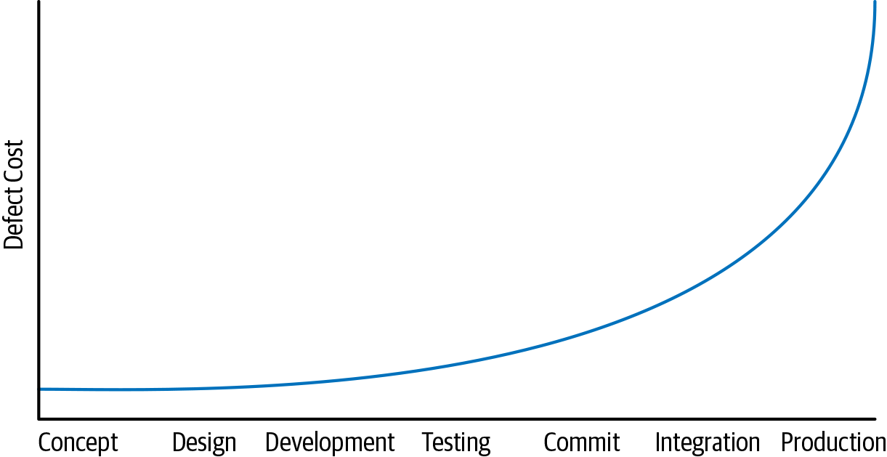

# 范围与效率

正如 Site Reliability Engineering (SRE) 一书中所述，11 Google 的整个生产系统是人类创造的最复杂的机器之一。 制造这样一台机器并保持其平稳运行所涉及的复杂性需要我们组织和全球各地的专家进行无数小时的思考、讨论和重新设计。 所以，我们已经写了一本关于保持机器以这种规模运行的复杂性的书。

本书的大部分内容都侧重于生产这种机器的组织规模的复杂性，以及我们用来保持该机器长时间运行的流程。再次考虑代码库可持续性的概念：“当您能够安全地更改所有应该更改的事情并且可以在代码库的整个生命周期中这样做时，您组织的代码库就是可持续的。”隐藏在能力讨论中的还有一项成本：如果改变某件事的成本过高，它可能会被推迟。如果成本随着时间的推移呈超线性增长，那么运营显然是不可扩展的。12 最终，时间会停滞不前，并且会出现一些您绝对必须改变的意外情况。当您的项目范围扩大一倍并且您需要再次执行该任务时，是否会增加两倍的劳动密集度？下次您还会有解决问题所需的人力资源吗？

&#x20;人力成本并不是唯一需要扩展的有限资源。正如软件本身需要与传统资源（如计算、内存、存储和带宽）很好地扩展一样，软件的开发也需要扩展，无论是在人力投入还是支持开发工作流程的计算资源方面。如果您的测试集群的计算成本呈超线性增长，每个季度每人消耗更多的计算资源，那么您将走上一条不可持续的道路，需要尽快做出更改。&#x20;

最后，软件组织最宝贵的资产——代码库本身——也需要扩展。如果您的构建系统或版本控制系统随着时间的推移呈超线性扩展，可能是由于增长和更改日志历史记录的增加，那么您可能无法继续进行下去。许多问题，例如“完成完整构建需要多长时间？”、“提取存储库的新副本需要多长时间？”或“升级到新版本需要多少费用？”语言版本？”没有受到积极监控并且变化缓慢。它们很容易变成比喻中的水煮青蛙；问题很容易缓慢恶化，而且永远不会表现为单一的危机时刻。只有在组织范围内意识到并致力于扩展，您才有可能始终关注这些问题。&#x20;

您的组织依赖于生成和维护代码的一切都应该在总体成本和资源消耗方面具有可扩展性。特别是，您的组织必须重复执行的所有工作都应该在人力方面具有可扩展性。从这个意义上说，许多常见的策略似乎没有可扩展性。

### 不可扩展的策略

稍加练习，就可以更容易地发现具有不良扩展属性的策略。最常见的是，这些可以通过考虑强加给单个工程师的工作并想象组织扩大 10 或 100 倍来确定。当我们的规模扩大 10 倍时，我们是否会增加 10 倍我们的样品工程师需要跟上的工作？我们的工程师必须执行的工作量是否随着组织规模的增加而增长？工作是否随着代码库的大小而扩大？如果其中任何一个是真的，我们是否有任何机制来自动化或优化该工作？如果没有，我们就会遇到缩放问题。&#x20;

考虑一种传统的弃用方法。我们在第 15 章中更多地讨论了弃用，但弃用的常见方法是扩展问题的一个很好的例子。开发了一个新的小部件。决定每个人都应该使用新的并停止使用旧的。为了激励这一点，项目负责人说“我们将在 8 月 15 日删除旧的 Widget；确保您已转换为新的 Widget。”&#x20;

这种类型的方法可能适用于小型软件设置，但随着依赖图的深度和广度的增加，很快就会失败。团队依赖于越来越多的 Widget，一次构建中断可能会影响公司越来越多的比例。以可扩展的方式解决这些问题意味着改变我们弃用的方式：团队可以利用所提供的所有规模经济，自己将迁移工作内部化，而不是将迁移工作推给客户。&#x20;

2012 年，我们试图通过减少流失的规则来阻止这种情况：基础设施团队必须自己将内部用户转移到新版本或以向后兼容的方式进行适当的更新。这个我们称之为“流失规则”的政策可以更好地扩展：依赖项目不再只是为了跟上进度而花费更多的精力。我们还了解到，让专门的专家组执行变更量表比要求每个用户进行更多的维护工作更好：专家花一些时间深入了解整个问题，然后将这些专业知识应用于每个子问题。强迫用户响应流失意味着每个受影响的团队在提升、解决他们眼前的问题、然后扔掉现在无用的知识方面做得更糟。专业知识可以更好地扩展。&#x20;

开发分支的传统使用是具有内置扩展问题的策略的另一个示例。组织可能会发现将大型功能合并到主干中已经破坏了产品的稳定性并得出结论，“我们需要更严格地控​​制何时合并。我们应该减少合并的频率。”这很快导致每个团队或每个功能都有单独的开发分支。每当决定任何分支“完成”时，都会对其进行测试并合并到主干中，从而以重新同步和测试的形式为仍在开发分支上工作的其他工程师触发一些潜在的昂贵工作。可以使这种分支机构管理适用于一个拥有 5 到 10 个此类分支机构的小型组织。随着组织规模（和分支机构数量）的增加，我们很快就会发现，我们为完成同样的任务而支付的管理费用越来越多。随着规模的扩大，我们将需要一种不同的方法，我们将在第 16 章中讨论。

### 可很好扩展的政策

随着组织的发展，什么样的政策会带来更好的成本？或者，更好的是，随着组织的发展，我们可以制定什么样的政策来提供超线性价值？&#x20;

我们最喜欢的内部政策之一是基础设施团队的重要推动者，保护他们安全地进行基础设施更改的能力。 “如果产品因基础架构更改而出现中断或其他问题，但我们的持续集成 (CI) 系统中的测试并未发现问题，这不是基础架构更改的错。”更通俗地说，这被表述为“如果你喜欢它，你应该对它进行 CI 测试”，我们称之为“碧昂斯规则”。13 从扩展的角度来看，碧昂斯规则意味着复杂的、一次性的定制不是由我们的通用 CI 系统触发的测试不计算在内。如果没有这个，基础设施团队的工程师可能需要追踪每个团队的任何受影响的代码，并询问他们如何运行测试。当有一百名工程师时，我们可以做到这一点。我们绝对不能再这样做了。&#x20;

我们发现，随着组织规模的扩大，专业知识和共享交流论坛可以提供巨大的价值。当工程师在共享论坛中讨论和回答问题时，知识往往会传播。新专家成长。如果您有 100 名工程师在编写 Java，那么一位愿意回答问题的友好且乐于助人的 Java 专家很快就会培养出 100 名编写更好 Java 代码的工程师。知识是病毒式的，专家是载体，对于清除工程师常见的绊脚石的价值，有很多话要说。我们在第 3 章中更详细地介绍了这一点。

### 示例：编译器升级

考虑升级编译器的艰巨任务。 从理论上讲，考虑到语言向后兼容需要付出多少努力，编译器升级应该很便宜，但在实践中它的操作成本有多低？ 如果您以前从未进行过这样的升级，您将如何评估您的代码库是否与该更改兼容？

根据我们的经验，语言和编译器升级是微妙而艰巨的任务，即使它们被广泛认为是向后兼容的。编译器升级几乎总是会导致行为的微小变化：修复错误编译、调整优化或可能更改任何先前未定义的结果。您将如何根据所有这些潜在结果评估整个代码库的正确性？

谷歌历史上最著名的编译器升级要追溯到 2006 年。 那时，我们已经运营了几年，拥有数千名工程师。我们已经有大约五年没有更新编译器了。我们的大多数工程师都没有更改编译器的经验。我们的大部分代码只暴露于一个编译器版本。对于一个（主要是）志愿者团队来说，这是一项艰巨而痛苦的任务，最终成为寻找捷径和简化的问题，以解决我们不知道如何采用的上游编译器和语言更改。 14最后，2006 编译器升级极其痛苦。许多大大小小的海鲁姆定律问题已经潜入代码库，加深了我们对特定编译器版本的依赖。打破那些隐含的依赖是痛苦的。有问题的工程师正在冒险：我们还没有 Beyoncé Rule，也没有普遍的 CI 系统，所以很难提前知道变更的影响或确定他们不会归咎于回归。

&#x20;这个故事一点也不奇怪。许多公司的工程师可以讲述一个类似的关于痛苦升级的故事。不同寻常的是，我们认识到这项任务是痛苦的，并开始专注于技术和组织变革，以克服扩展问题并将规模转化为我们的优势：自动化（以便一个人可以做更多的事情）、整合/一致性（以便低级更改具有有限的问题范围）和专业知识（以便少数人可以做更多）。&#x20;

您更改基础架构的频率越高，这样做就越容易。我们发现，大多数情况下，当代码作为编译器升级之类的一部分进行更新时，它会变得不那么脆弱，并且在未来更容易升级。在大多数代码都经过多次升级的生态系统中，它会根据底层实现的细微差别停止；相反，它取决于语言或操作系统保证的实际抽象。无论您究竟要升级什么，预计代码库的第一次升级比后续升级要贵得多，即使控制其他因素也是如此。

通过这些和其他经验，我们发现了许多影响代码库灵活性的因素：&#x20;

_专业知识_&#x20;

&#x20;   我们知道如何做到这一点；对于某些语言，我们现在已经在许多平台上进行了数百次编译器升级。&#x20;

_稳定_&#x20;

&#x20;   版本之间的变化较少，因为我们更经常地采用版本；对于某些语言，我们现在每两周部署一次编译器升级。&#x20;

_一致性_&#x20;

&#x20;   没有经过升级的代码较少，同样是因为我们正在定期升级。&#x20;

_熟悉度_&#x20;

&#x20;   因为我们经常这样做，所以我们可以在执行升级和尝试自动化的过程中发现冗余。这与 SRE 对劳动的看法有很大的重叠。&#x20;

_政策_&#x20;

&#x20;   我们有像碧昂斯规则这样的流程和政策。这些过程的最终效果是升级仍然可行，因为基础设施团队不需要担心每一个未知的使用，只需要担心在我们的 CI 系统中可见的使用。&#x20;

潜在的教训不是关于编译器升级的频率或难度，而是一旦我们意识到编译器升级任务是必要的，我们就找到了确保用恒定数量的工程师执行这些任务的方法，即使代码库16 如果我们改为认为该任务太昂贵并且将来应该避免，我们可能仍在使用十年前的编译器版本。由于错过了优化机会，我们可能会为计算资源支付 25% 的额外费用。鉴于 2006 年时代的编译器肯定无助于缓解推测执行漏洞，我们的中央基础设施可能容易受到重大安全风险的影响。停滞是一种选择，但通常不是明智的选择。

### 左移

我们已经看到的一个广泛的事实是这样的想法，即在开发人员工作流程的早期发现问题通常会降低成本。考虑一个功能的开发人员工作流的时间表，从左到右，从概念和设计开始，到实施、审查、测试、提交、金丝雀和最终的生产部署。在此时间线上更早地将问题检测转移到“左”，这样修复比等待更长时间更便宜，如图 1-2 所示。&#x20;

这个术语似乎源于这样一种论点，即安全性不能推迟到开发过程结束时，必须要求“安全性左移”。这种情况下的论点相对简单：如果安全问题是在您的产品投入生产后才发现的，那么您就有了一个非常昂贵的问题。如果在部署到生产环境之前被发现，可能仍然需要大量的工作来识别和解决问题，但成本更低。如果你能在原始开发人员将缺陷提交给版本控制之前发现它，那就更便宜了：他们已经了解了该功能；根据新的安全约束进行修改比提交并强迫其他人对其进行分类和修复更便宜。

同样的基本模式在本书中多次出现。 在提交之前通过静态分析和代码审查捕获的错误比使其投入生产的错误便宜得多。 在开发过程的早期提供突出质量、可靠性和安全性的工具和实践是我们许多基础架构团队的共同目标。 没有一个流程或工具需要完美，因此我们可以假设采用深度防御方法，希望尽可能多地捕获图表左侧的缺陷。
